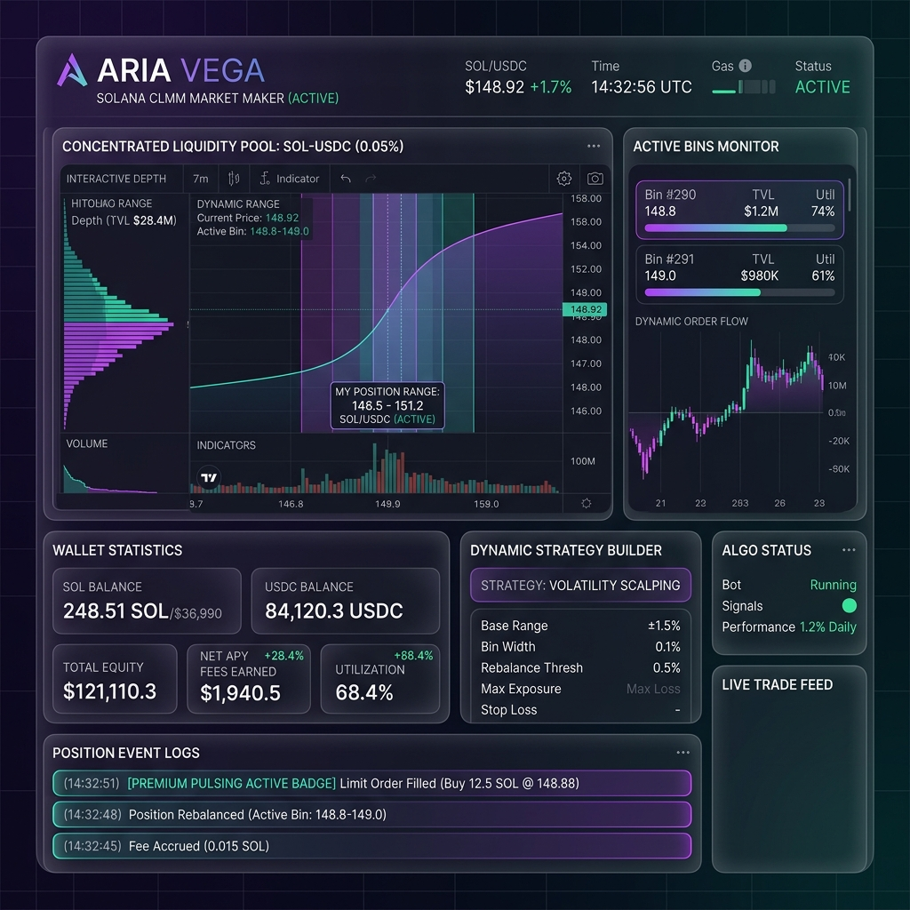

# 🌌 Aria Vega — Market Maker

A highly structured, stateless-orchestrated automation system for Solana CLMM liquidity provision (Meteora DLMM) integrated via Hummingbot API.



## 🚀 Key Features

- **Stateless Rebalancing Workflows**: Sequential modular steps execute price check, range shift calculations, JIT open/close legs, and transaction safety caps.
- **Hummingbot Gateway Integration**: Real-time position management, balance sync, and secure on-chain transaction execution on Solana.
- **Crash-Resilient State Machine**: Write-ahead task recovery and sync handlers guarantee execution tracking across system restarts.
- **Interactive Control Panel**: Next.js-powered dark-mode UI with active bin monitors, strategy builder, wallet statistics, and event logging.

## 🛠️ Quick Start

```bash
# Start full development stack (Engine, Frontend, Hummingbot, Gateway)
docker compose -f docker-compose.dev.yml up -d --build

# Run tests
pnpm test
```
