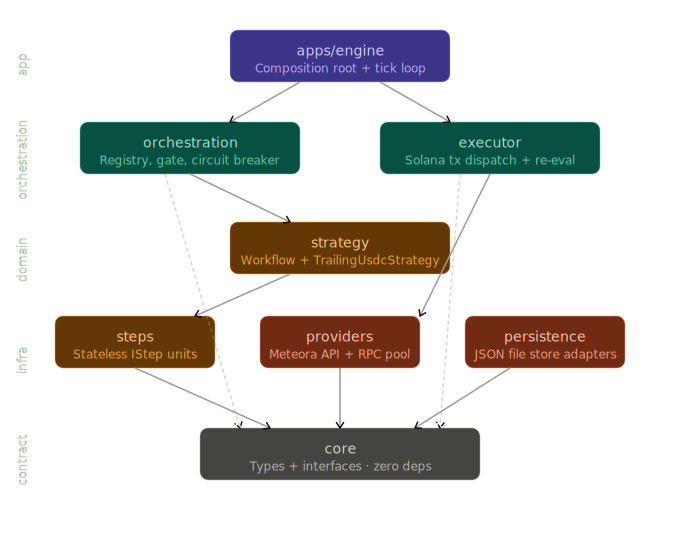
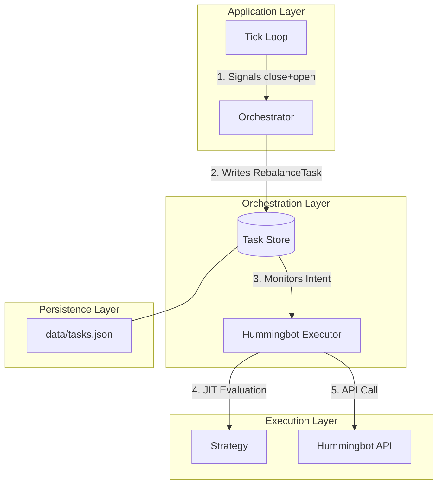
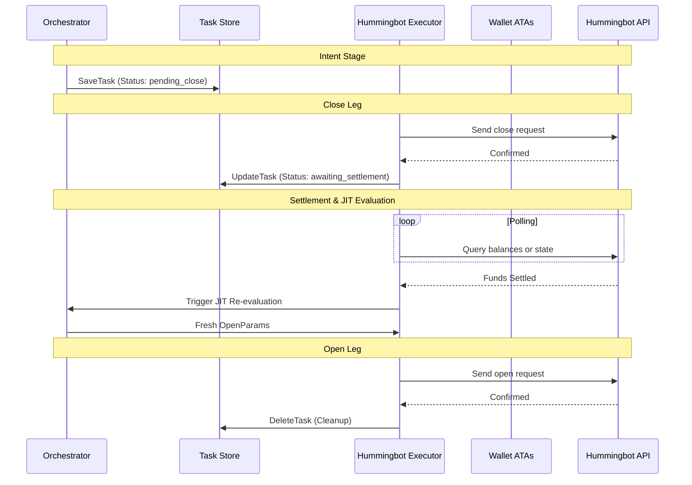
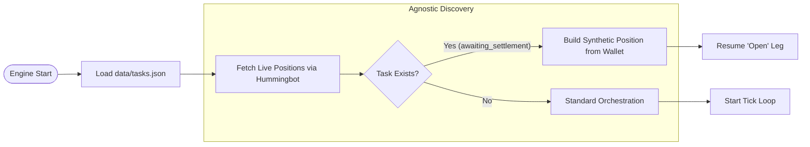
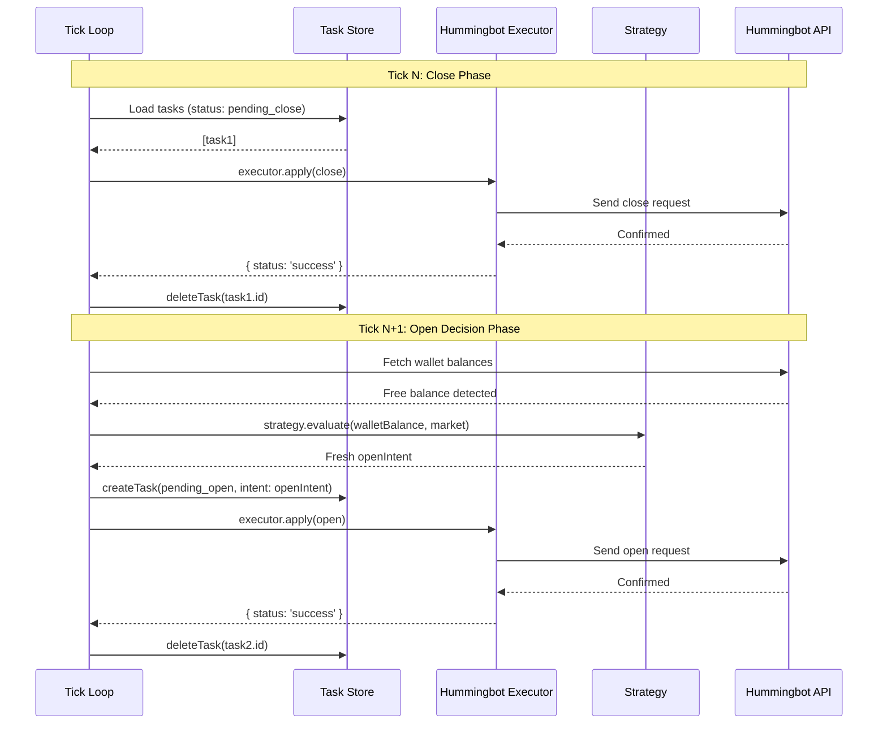

# Aria Vega Market Maker: Stateful Rebalance & Intent Architecture

This document defines the **Task-Intent (Write-Ahead Intent)** architecture designed to ensure atomic integrity during position rebalancing. This architecture prevents "Ghost Position" errors and manages signal decay during network congestion.

Following the refactor to use the Hummingbot API, the system offloads direct blockchain execution and data fetching to the Hummingbot Gateway.

---

## 2. High-Level Domain Architecture

The system is organized into a vertical hierarchy where the **Task Store** acts as the persistent "glue" between strategy logic and execution via the Hummingbot API.

Show Mermaid Source

---

## 3. Architectural Pillar: The Rebalance Task Store

To resolve state blindness, the system moves from a "Reactive" model to an **Intent-First** model.

### A. Data Model: `RebalanceTask`

A persistent record stored in `data/tasks.json` that tracks the lifecycle of a rebalance.

| Field                | Type       | Description                                                       |
| :------------------- | :--------- | :---------------------------------------------------------------- |
| `id`                 | `string`   | Unique UUID for the rebalance operation.                          |
| `assignmentId`       | `string`   | Link to the strategy configuration.                               |
| `status`             | `string`   | `pending_close` → `awaiting_settlement` → `pending_open`.         |
| `originalPositionId` | `string`   | The ID of the position being closed.                              |
| `intent`             | `Decision` | The full `Decision` object, including range and metadata.         |
| `evaluatedAt`        | `number`   | Timestamp of the strategy evaluation for JIT staleness checks.    |
| `closeBalances`      | `object`   | Snapshot of token balances at the moment of `close` confirmation. |

> [!IMPORTANT]
> **Data Integrity and Schema Validation**
> All persistence files must be loaded with strict schema validation (e.g., Zod). A corrupted `tasks.json` is a worst-case failure mode, and structural validation ensures the state machine never operates on partial or malformed data.

### B. Stateful Rebalance Flow (Atomic Integrity)

This flow ensures that if the system crashes after closing a position, it knows exactly how to resume the "open" leg.

Show Mermaid Source

---

## 4. Recovery Flow (Agnostic Discovery)

Upon startup, the engine synchronizes live data from the Hummingbot API with local persistent intents.

Show Mermaid Source

---

## 5. Just-In-Time (JIT) Re-Evaluation

To mitigate signal decay, the system enforces a **Staleness Check** before the final `open` transaction.

- **TTL Validation**: The executor compares `Date.now() - task.evaluatedAt` against a configurable `MAX_SIGNAL_AGE_MS` threshold.
- **JIT Trigger**: If the signal is stale, the executor transitions the task back to `awaiting_settlement` to trigger a re-tick and get fresh boundaries/rates.

---

## 6. The Synthetic Position Factory

When a position is closed, the system cannot fetch its state directly. The **Synthetic Position Factory** bridges this gap during the `awaiting_settlement` phase by using settled tokens attributable to the task.

---

## 7. Key Engineering Guardrails

- **Execution Lock**: The `Orchestrator` uses a public `isExecuting` flag to ignore new `Tick Loop` signals while a `RebalanceTask` is in progress.
- **Write-Ahead Intent**: The `RebalanceTask` is written to disk _before_ the first transaction is signed.
- **Circuit Breakers**:
  - **Hummingbot API**: Enforces a maximum snapshot age to prevent the Tick Loop from evaluating positions against stale market snapshots.
  - **API Circuit Breaker**: Halts new task generation and pauses in-flight tasks if the Hummingbot API error rate exceeds configured thresholds.

---

# Appendix B: Stateless Rebalancing (v2)

> **Status**: Proposed for Issue #39  
> **Goal**: Simplify the state machine by eliminating `awaiting_settlement` and the JIT polling loop

---

## B.3 Stateless Rebalance Flow

